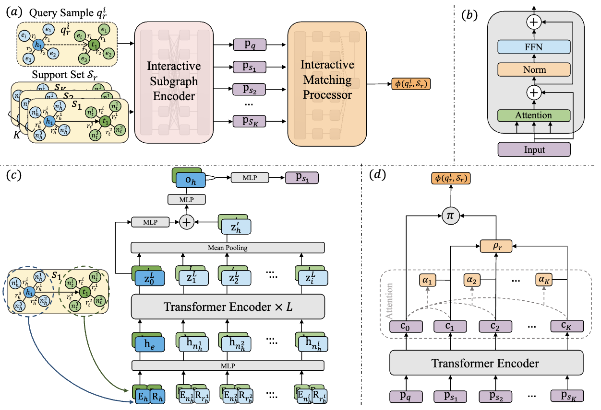

<h1 align="center"> Semantic Interaction Matching Network for Few-Shot Knowledge Graph Completion </h1>

<p align="center"> 
  <a href="https://dl.acm.org/doi/10.1145/3589557" target="_blank">
     
  </a>
  <a href="#step-2-download-the-data">
     
  </a>
</p>

<p align="center"> This repository is the official implementation for the paper titled "Semantic Interaction Matching Network for Few-Shot Knowledge Graph Completion".  </p>

<p align="center">
  
</p>


## Usage

### Step 1: Set up the environment

We recommend using Conda to manage virtual environments, and we use Python version 3.8.12.
```bash
conda create -n sim python==3.8.12
conda activate sim
```

Please install the specified versions of Python libraries according to the requirements.txt file.

<div id="dataset"></div>

### Step 2: Download the data

- [Wiki-One](https://mailustceducn-my.sharepoint.com/:u:/g/personal/pfluo_mail_ustc_edu_cn/EYM4IprpNFtOs_bogwWnxXIBvt9y7bcGBfJ3gzDDuBfb7Q?e=Zo6p0U)
- [NELL-One](https://mailustceducn-my.sharepoint.com/:u:/g/personal/pfluo_mail_ustc_edu_cn/EZHWyyhZT0dBpqj4qrTJJ-MB8T_t3B95GETy_ZCLUqrsCg?e=C0bA6S)


### Step 3: Modify the data path


Please modify the `dataset` parameter in the `run_nell_all_fold.sh` and `run_wiki_all_fold.sh` script to the path where you have stored the data.

### Step 4: Start the training

Now you can execute `bash run_<dataset>_all_fold.sh` to begin the training.
```bash
bash run_nell_all_fold.sh
bash run_wiki_all_fold.sh
```

## Citation
If you find this project useful in your research, please cite the following paper:
```bibtex
@artical{luo2023semantic,
    author = {Luo, Pengfei and Zhu, Xi and Xu, Tong and Zheng, Yi and Chen, Enhong},
    title = {Semantic Interaction Matching Network for Few-Shot Knowledge Graph Completion},
    year = {2023},
    publisher = {Association for Computing Machinery},
    journal = {ACM Trans. Web}
}
```


## Contact Information

If you have any questions, please contact pfluo@mail.ustc.edu.cn.